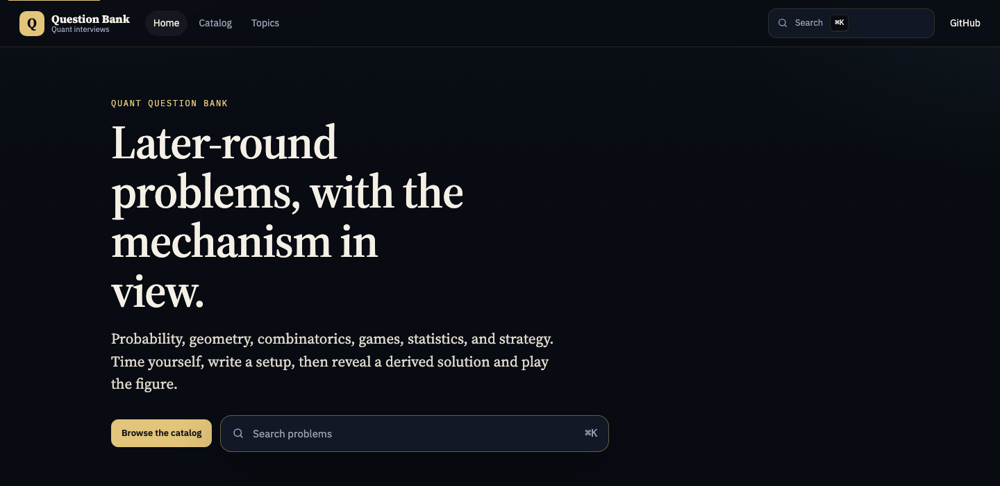

# Quant Question Bank

A public desk of later-round quant interview problems: probability, geometry, combinatorics, games, statistics, and strategy.

Each problem hides the solution until you reveal it, includes a timer, and has an interactive figure so you can see the mechanism instead of only reading algebra.

Statuses (attempted, confident, revisit), notes, and practice sessions stay in this browser. Progress appears on home and on `#practice`. Continue practicing walks revisit, then unseen, then attempted. Random hard, timed sets, topic drills, and mixed mock interviews live at `#practice`.

Use it at [https://quant-question-bank.vercel.app](https://quant-question-bank.vercel.app). Search from the header or with Command+K (Ctrl+K on Windows/Linux).

## Contribute

Read [CONTRIBUTING.md](CONTRIBUTING.md) and [AGENTS.md](AGENTS.md) before you change the catalog or the public copy.

Work on a branch, then open a pull request into `main`. Do not commit or push to `main`.

### Add a problem

Follow [skills/add-problem/SKILL.md](skills/add-problem/SKILL.md).

Short version: derive the answer, add a `String.raw` record with `topic` and `difficulty`, register a canvas figure on `window.Visuals`, never put raw `<` inside math.

Pull requests should say which answers you derived and how you checked the figure.

### Checks

`npm test` validates the catalog and runs the browser checks. Details live in [AGENTS.md](AGENTS.md).

The site itself stays static. `package.json` is only for those checks. Vercel skips install and build. Deploys go to the `quant-question-bank` Vercel project at the URL above, not to any `quant-interview-prep` project.

## License

MIT. See [LICENSE](LICENSE).
